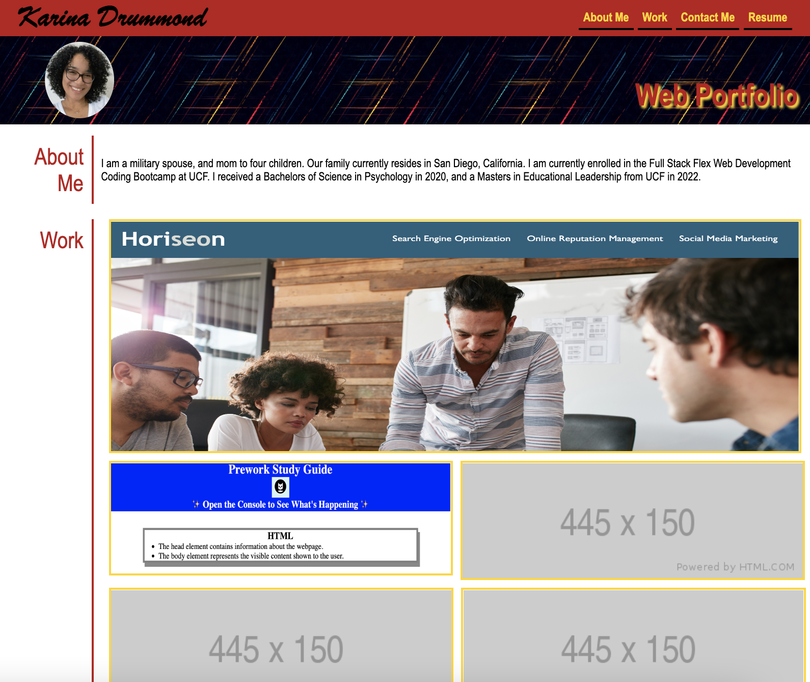
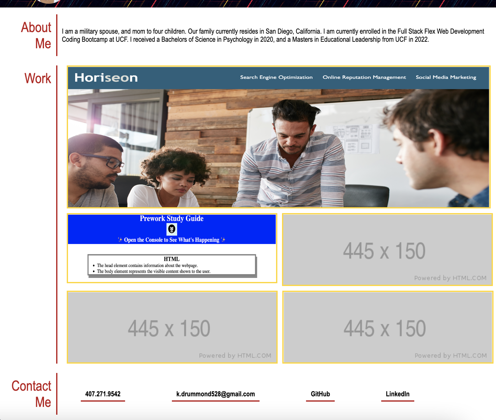

# My Personal Portfolio
This portfolio is a showcase of the skills I have learned, and projects I have completed to present. It will also include an about me section with personal details about myself, my contact information, as well as my LinkedIn and GitHub links for future potential employers.

## Creation of Portfolio
I have created this portfolio completely from scratch with the knowledge I have obtained from the bootcamp, as well as from independent research and study. I plan to use this portfolio in the future when searching for jobs upon completion of the bootcamp.

I have learned much more during the process of creating this portfolio. I feel in the future as I continue to learn, I will continue to work on it and improve its overall appearance and functionality.

## Challenges Making The Porfolio
I encountered some difficulty entering text over the images under "My Work". I also experienced difficulty trying to adjust the footer to expand to the size of the page. I will continue to work on this until I am able to achieve the desired look.

Unfortunately, I ran out of time and was unable to add the hover effect over the images under "My Work" and enter a media query so the page elements adjusted to smaller screens appropriately.

## Mock-Up
The following animation shows what the intended web application's appearance and functionality initially was:

## Actual Porfolio
This following screenshots show the appearance of my personal porfolio:

    

## Links To My Portfolio

https://github.com/kdrummond528/Personal-Portfolio
 
https://kdrummond528.github.io/Personal-Portfolio/

file:///Users/christopherdrummond/bootcamp/UCF/hw/mod-2-ch/index.html