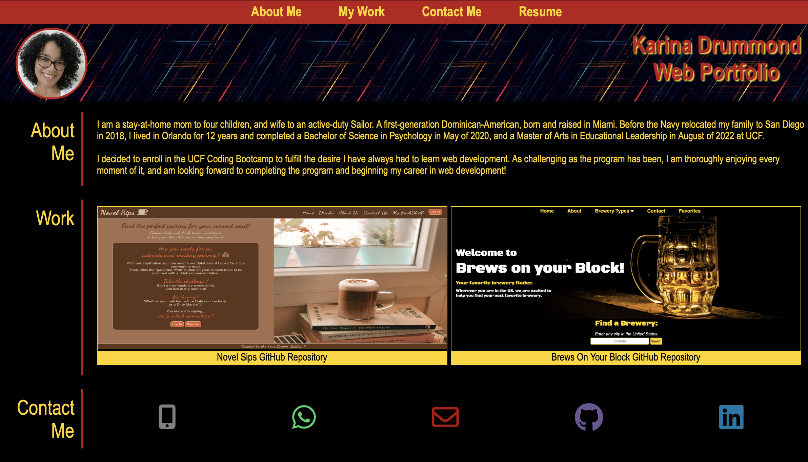
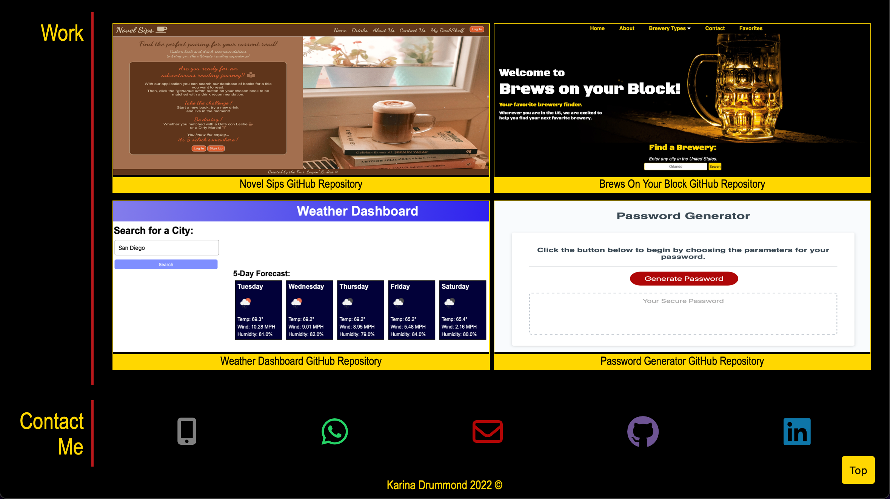

# My Personal Portfolio

## Description
This portfolio is a showcase of the skills I have learned, and projects I have completed to present. It will also include an about me section with personal details about myself, my contact information, as well as my LinkedIn and GitHub links for future potential employers.

## Table of Contents
* [Creation of Portfolio](#creation-of-portfolio)
* [Mock-Up](#mock-up)
* [Demo of my Portfolio](#demo-of-my-portfolio)
* [Links To My Portfolio](#links-to-my-portfolio)
* [Questions](#questions)

## Creation of Portfolio
I have created this portfolio completely from scratch with the knowledge I have obtained from the bootcamp, as well as from independent research and study. I plan to use this portfolio in the future when searching for jobs upon completion of the bootcamp.

I have learned much more during the process of creating this portfolio. I feel in the future as I continue to learn, I will continue to work on it and improve its overall appearance and functionality.

## Mock-Up
The following animation shows what the intended web application's appearance and functionality initially was:

## Demo of my Portfolio

This following screenshots show the current appearance of my personal porfolio, including past work I have completed since initally creating the portfolio:

To show my progress I have also included the following screenshots showing the initial appearance of my portfolio when created in the first week of the Coding Bootcamp:

    

## Links To My Portfolio

- [Link to GitHub Repository](https://github.com/kdrummond528/Personal-Portfolio)

- [Link to Deployed Website](https://kdrummond528.github.io/Personal-Portfolio/)

## Questions

Feel free to [email me](mailto:k.drummond528@gmail.com) with any questions, comments, or requests.

Checkout my [GitHub profile](https://github.com/kdrummond528)!